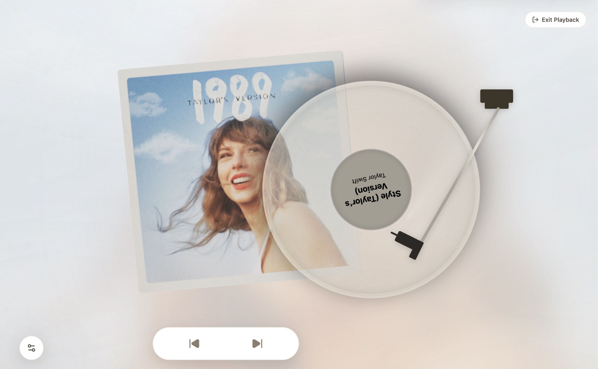

<p align="center">
  
</p>

<h1 align="center">SpinDeck 🎵</h1>

<p align="center"><strong>Cross-platform vinyl visualization player</strong> — organize playlists in your browser, browse a 3D album shelf, and sync playback with your local music apps through an interactive tonearm UI.</p>

<p align="center"><em>SpinDeck doesn't stream or host any audio. Your music apps handle playback; we handle playlists and control.</em></p>

<p align="center">
  English · <a href="./README.zh-Hans.md">简体中文</a> · <a href="https://spindeck.dgct.cc">📖 Official Documentation</a>
</p>

<p align="center">
  <a href="https://github.com/dongguacute/SpinDeck/releases"></a>
  <a href="https://nodejs.org/">= 18" /></a>
  <a href="https://www.rust-lang.org/"></a>
  <a href="https://pnpm.io/"></a>
</p>

---

## 👀 Preview



This is SpinDeck's playback screen: a translucent vinyl record and draggable tonearm over the album art, with a soft background tinted from the cover. Track info sits on the disc label; **Exit Playback**, visual settings, and prev/next controls ring the edges.

> **📸 Screenshot copyright notice**  
> The album artwork (*1989 (Taylor's Version)*) and song title (*Style (Taylor's Version)*) shown in the preview belong to **Taylor Swift** and their respective copyright holders (including Republic Records). They are used here **solely for demonstration** of SpinDeck's UI and are **not** hosted, distributed, or licensed by this project. SpinDeck does not claim any rights to this content.

---

## ✨ What It Does

### 📋 Playlist Management

- Create, edit, and bulk-delete playlists — everything stays local in your browser
- Import playlists from **QQ Music**, **NetEase Cloud Music**, or **Kugou Music** via share links (up to 300 tracks per import)
- Manually create playlists (metadata only, no track list)
- Auto-refresh imported playlists every 5 / 15 / 30 minutes or 1 hour to stay in sync with the source

### 🗄️ 3D Playlist Shelf

- A Three.js-rendered 3D shelf — flip through album covers like a real rack
- Tap a record to play; skip tracks with prev/next controls or swipe gestures
- Dynamic backgrounds from cover art; upload a custom background and tweak blur
- Viewport-aware loading — meshes and covers mount near the scroll center to keep memory in check

### 🎛️ Vinyl Tonearm

- Drag the tonearm to **drop the needle (play) or lift it (pause)** — tactile, turntable-like interaction
- Classic or modern disc styles
- Playback state syncs with your connected music app (where the platform supports it)

### 🎨 Appearance & Language

- Light, dark, or follow system
- UI in **English** and **Simplified Chinese**

---

## 🚀 Typical Workflow

1. Open SpinDeck, create a playlist, paste a share link from a supported platform
2. Once import finishes, open the **playlist shelf** and browse the covers
3. Pick a track — the tonearm UI appears; drop the needle and your local music app starts playing
4. Tweak theme, language, and visuals in Settings

That's it. No account, no cloud upload — just your playlists and your player.

---

## 🎧 Supported Music Platforms

Progress varies by platform. Only **QQ Music** is fully supported end to end today.

| Platform | Playlist Import | Playback Control | Status |
|----------|:-----------------:|:----------------:|--------|
| **QQ Music** | ✅ | ✅ | **Fully supported** — import + playback control |
| **NetEase Cloud Music** | ✅ | Desktop only | Import works; playback control on **desktop** (macOS / Windows) |
| **Kugou Music** | ✅ | — | **Import only** — no playback control (technical limitations) |
| **Apple Music** | — | — | Not implemented yet |
| **Spotify** | — | — | Not implemented yet |
| **YouTube Music** | — | — | Not implemented yet |

> **💡 Notes**
>
> - **QQ Music** is the most complete: playlist import, playback control, and cross-device deep links.
> - **NetEase Cloud Music** — import everywhere, but tonearm playback sync is **desktop only** (not mobile).
> - **Kugou Music** — import for browsing in SpinDeck, but no reliable way to control the Kugou app from here.
> - Apple Music, Spotify, and YouTube Music show up in the UI for future use — **no working integration yet**.

---

## 💻 Runtime

SpinDeck is a **SPA frontend** plus a **desktop-only Tauri shell** (native WebView + `invoke` / `cover://`). Run the UI in a browser for preview, or use the **Tauri desktop app** for the full experience (recommended on macOS for playback control).

| Environment | Notes |
|-------------|-------|
| Browser | Any modern browser — UI preview. Playlist import and local playback need the desktop app |
| **Desktop (Tauri)** | macOS / Windows / Linux; native WebView + Tauri `invoke` / `cover://`. **No Node.js on the user’s machine** |
| Desktop (macOS / Windows) | Full QQ Music experience; NetEase playback control here too |
| Mobile (iOS / Android) | QQ Music via deep links; NetEase playback control not supported |

---

## 📦 Version & Requirements

### Latest release

Download the newest desktop builds from **[GitHub Releases](https://github.com/dongguacute/SpinDeck/releases)** — the release title and tag show the current version (e.g. `v0.1.0`).

To read the version from a cloned repo:

```bash
node -p "require('./package.json').version"
```

### Development requirements

| Tool | Version | Required for |
|------|---------|--------------|
| [Node.js](https://nodejs.org/) | **≥ 18** | Web / docs development and frontend builds only |
| [pnpm](https://pnpm.io/) | **9.x** (repo pins `9.0.0`) | Installing dependencies and all `pnpm` scripts |
| [Rust](https://rustup.rs/) | stable | Desktop (Tauri) dev & release builds |
| Platform toolchain | — | e.g. Xcode Command Line Tools on macOS |

These are declared in root [`package.json`](package.json) (`engines.node`, `packageManager`). CI uses **Node 20** and **pnpm 9**.

Enable the pinned pnpm via [Corepack](https://nodejs.org/api/corepack.html):

```bash
corepack enable
pnpm -v   # should report 9.x
node -v   # should report v18 or newer
```

---

## 🛠️ Quick Start

### Requirements

See **[Version & Requirements](#-version--requirements)** above. In short: **Node.js ≥ 18**, **pnpm 9.x**; add **Rust (stable)** for desktop development.

### Local Development (Web UI)

```bash
# Clone the repo
git clone https://github.com/dongguacute/SpinDeck.git
cd SpinDeck

# Install dependencies
pnpm install

# Start the web SPA dev server (UI only)
pnpm dev
```

Open the local URL printed in your terminal. Playlist import and playback require the desktop app (below).

### Desktop App (Tauri)

You'll also need:

- [Rust](https://rustup.rs/) (stable)
- Platform toolchain (e.g. Xcode Command Line Tools on macOS)

**Development** — Tauri starts the web Vite server and loads it in the WebView:

```bash
pnpm --filter @spindeck/desktop dev
```

Loads `@spindeck/web` via `http://localhost:5173` and opens the SpinDeck window. Desktop features use `invoke` / `cover://`. App icon matches `apps/web/app/assets/icons/SpinDeckLogo.svg`.

**Production build** — builds the SPA into Tauri `frontendDist`, then runs `tauri build`. The packaged app loads the SPA via Tauri’s native asset protocol:

```bash
pnpm --filter @spindeck/desktop build
```

Output: `apps/desktop/src-tauri/target/release/bundle/` (`.app` on macOS, `.msi` / `.exe` on Windows, etc.). **End users do not need Node.js.**

Regenerate desktop icons after logo changes:

```bash
pnpm desktop:icons
```

### Build (Web SPA only)

```bash
pnpm --filter @spindeck/web build
```

Static output: `apps/web/build/client` (used by the desktop bundle).

### Other Commands

```bash
pnpm lint          # Lint (ESLint + desktop Clippy/fmt)
pnpm check-types   # Type check
pnpm format        # Format code
pnpm dev:docs      # Docs site (VitePress)
```

Pre-commit (`husky` + `lint-staged`) runs ESLint on staged JS/TS and `pnpm --filter @spindeck/desktop lint` when Rust/`Cargo.toml` under `apps/desktop/src-tauri` is staged.

---

## 📁 Project Structure

pnpm + Turborepo monorepo. **UI lives in TypeScript; playlist import and local playback control live in Rust inside the desktop app.**

| Path | Role |
|------|------|
| [`apps/web`](apps/web) | SPA frontend (React Router, `ssr: false`). Talks to desktop via `invoke` |
| [`apps/desktop`](apps/desktop) | Tauri shell + Rust (`commands/`, `cover`, `playlist/`, `playback/`) |
| [`packages/player`](packages/player) | Client playback strategy, deep links, session (Tauri desktop bridge) |
| [`packages/vinyl-ui`](packages/vinyl-ui) | Vinyl tonearm UI components |
| [`packages/ui`](packages/ui) | Shared UI components & themes |
| [`packages/picker`](packages/picker) | Cover art color extraction & backgrounds |
| [`docs`](docs) | VitePress documentation site |

**Dev / prod desktop:** SPA via Tauri WebView; features via `invoke` and `cover://`.

**Desktop IPC:** `import_playlist`, `play_song`, `pause_song`, `resume_song`, `playback_status`, `set_play_mode`.

Longer write-up: [Architecture](docs/en/guide/architecture.md) (中文：[架构](docs/zh/guide/architecture.md)). Each app and shared package also has its own README.

---

## ⚠️ Disclaimer

- This project is **for personal learning and technical exchange** — not for commercial use.
- All media content and data come from third-party services. SpinDeck **does not host or store** any copyrighted music files.
- Please comply with each music platform's terms of service and applicable laws when using this project.

---

## 📄 License

Licensed under the [Apache License 2.0](LICENSE).

---

## 🔗 Links

- **Documentation**: <https://spindeck.dgct.cc>
- **Repository**: <https://github.com/dongguacute/SpinDeck>
- **Issues**: <https://github.com/dongguacute/SpinDeck/issues>
- **Author**: Cherry Fu · [@dongguacute](https://github.com/dongguacute)

If SpinDeck is useful to you, a ⭐ on GitHub means a lot — thanks for stopping by!
