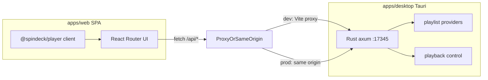

# Architecture

SpinDeck is a **SPA frontend** plus a **desktop-only Rust local API**. The UI never talks to a remote SpinDeck backend; playlist import and local playback control run on `127.0.0.1` inside the Tauri app.

## Runtime model

| Mode | What runs | Notes |
| --- | --- | --- |
| Browser / web-only | Vite SPA | UI preview. `/api` needs the desktop Rust server on `127.0.0.1:17345` |
| Desktop (recommended) | Tauri + embedded Rust HTTP | Serves static SPA + `/api/*`. **No Node.js on the user’s machine** |

## Monorepo layout

| Path | Role |
| --- | --- |
| `apps/web` | SPA (React Router, `ssr: false`). Calls `/api/*` via `fetch` |
| `apps/desktop` / `src-tauri` | Tauri shell + Rust API (`app/`, `server/`, `api/`, `playlist/`, `playback/`, `util/`) |
| `packages/player` | Client playback strategy, deep links, session (calls desktop `/api`) |
| `packages/vinyl-ui` / `ui` / `picker` | Shared UI and cover color helpers |
| `docs` | VitePress documentation |

Playlist import used to live in a TypeScript `@spindeck/core` package; that logic now lives in Rust under `apps/desktop/src-tauri/src/playlist/`.

## Local HTTP API

The embedded server listens on **`127.0.0.1:17345`**.

| Method | Path | Purpose |
| --- | --- | --- |
| `POST` | `/api/import` | Import / refresh playlist (multipart form) |
| `GET` | `/api/image` | Cover-art proxy (size-limited) |
| `POST` | `/api/play-song` | Start playback in the local music app |
| `POST` | `/api/stop-song` | Pause / stop |
| `POST` | `/api/resume-song` | Resume |
| `POST` | `/api/playback-status` | Query local client playback state |
| `POST` | `/api/set-play-mode` | Set play mode when supported |

In **dev**, Vite (`apps/web`) proxies `/api` to `:17345`. In **production desktop**, the same Rust process serves the SPA and `/api/*` on the same origin.

## Frontend notes

- Playlists metadata stay in browser `localStorage`; song lists are fetched through `/api/import`.
- The 3D shelf mounts meshes and cover textures only near the scroll viewport to keep memory bounded; empty slots show a loading state until song data is ready.
- `@spindeck/player` is a **browser client** — it does not embed Node AppleScript servers anymore.

## Related guides

- [Getting Started](./getting-started)
- [Desktop App](./desktop)
- [Supported Platforms](./platforms)
