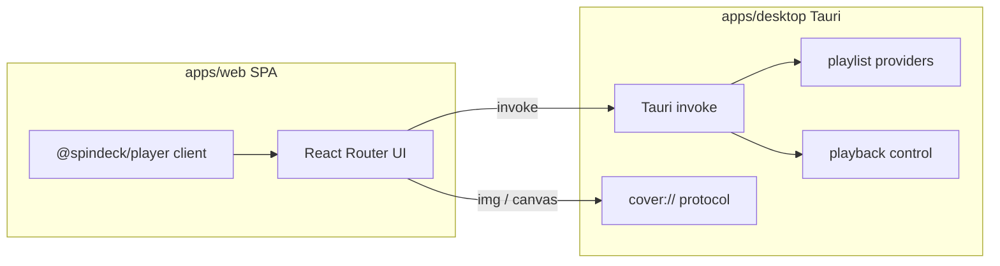

# Architecture

SpinDeck is a **SPA frontend** plus **desktop-only Rust capabilities** (Tauri `invoke` + `cover://`). The UI never talks to a remote SpinDeck backend; playlist import and local playback control run inside the desktop app process.

## Runtime model

| Mode | What runs | Notes |
| --- | --- | --- |
| Browser / web-only | Vite SPA | UI preview. Playlist import / local playback need the desktop app |
| Desktop (recommended) | Tauri + native WebView | SPA via `frontendDist`; features via `invoke`. **No Node.js on the user’s machine** |

## Monorepo layout

| Path | Role |
| --- | --- |
| `apps/web` | SPA (React Router, `ssr: false`). Calls desktop features via `invoke` |
| `apps/desktop` / `src-tauri` | Tauri shell + Rust (`app/`, `commands/`, `cover`, `playlist/`, `playback/`, `util/`) |
| `packages/player` | Client playback strategy, deep links, session (`setDesktopBridge`) |
| `packages/vinyl-ui` / `ui` / `picker` | Shared UI and cover color helpers |
| `docs` | VitePress documentation |

Playlist import used to live in a TypeScript `@spindeck/core` package; that logic now lives in Rust under `apps/desktop/src-tauri/src/playlist/`.

## Desktop IPC

| Command | Purpose |
| --- | --- |
| `import_playlist` | Import / refresh playlist |
| `play_song` | Start playback in the local music app |
| `pause_song` | Pause / stop |
| `resume_song` | Resume |
| `playback_status` | Query local client playback state |
| `set_play_mode` | Set play mode when supported |

Cover art is proxied through the custom protocol **`cover://localhost/?url=...`** (on Windows: `http://cover.localhost/?url=...`) with Referer headers and size limits.

## Frontend notes

- Playlists metadata stay in browser `localStorage`; song lists are fetched through `import_playlist`.
- The 3D shelf mounts meshes and cover textures only near the scroll viewport to keep memory bounded; empty slots show a loading state until song data is ready.
- `@spindeck/player` is a **browser client** — the desktop app wires Tauri via `setDesktopBridge`.

## Related guides

- [Getting Started](./getting-started)
- [Desktop App](./desktop)
- [Supported Platforms](./platforms)
