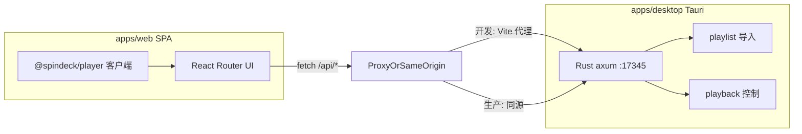

# 架构

SpinDeck 是 **SPA 前端** + **仅桌面端提供的 Rust 本地 API**。界面不访问远程 SpinDeck 后端；歌单导入与本地播放控制都在 Tauri 应用内的 `127.0.0.1` 上完成。

## 运行模型

| 模式 | 运行内容 | 说明 |
| --- | --- | --- |
| 浏览器 / 仅 Web | Vite SPA | UI 预览。`/api` 需要本机桌面端 Rust 服务监听 `127.0.0.1:17345` |
| 桌面端（推荐） | Tauri + 内嵌 Rust HTTP | 提供静态 SPA + `/api/*`。**用户机器不需要 Node.js** |

## Monorepo 布局

| 路径 | 职责 |
| --- | --- |
| `apps/web` | SPA（React Router，`ssr: false`），通过 `fetch` 调用 `/api/*` |
| `apps/desktop` / `src-tauri` | Tauri 壳 + Rust API（`app/`、`server/`、`api/`、`playlist/`、`playback/`、`util/`） |
| `packages/player` | 前端播放策略、深链接、会话（调用桌面 `/api`） |
| `packages/vinyl-ui` / `ui` / `picker` | 共享 UI 与封面取色 |
| `docs` | VitePress 文档 |

歌单导入曾位于 TypeScript 包 `@spindeck/core`；现已迁至 Rust：`apps/desktop/src-tauri/src/playlist/`。

## 本地 HTTP API

内嵌服务监听 **`127.0.0.1:17345`**。

| 方法 | 路径 | 用途 |
| --- | --- | --- |
| `POST` | `/api/import` | 导入 / 刷新歌单（multipart） |
| `GET` | `/api/image` | 封面图代理（有体积上限） |
| `POST` | `/api/play-song` | 在本地音乐应用中开始播放 |
| `POST` | `/api/stop-song` | 暂停 / 停止 |
| `POST` | `/api/resume-song` | 继续播放 |
| `POST` | `/api/playback-status` | 查询本地客户端播放状态 |
| `POST` | `/api/set-play-mode` | 设置播放模式（若平台支持） |

**开发时**，Vite（`apps/web`）将 `/api` 代理到 `:17345`。**生产桌面**中，同一 Rust 进程同源提供 SPA 与 `/api/*`。

## 前端说明

- 歌单元数据保存在浏览器 `localStorage`；曲目列表通过 `/api/import` 拉取。
- 3D 书架仅在滚动视口附近挂载 mesh 与封面纹理以控制内存；数据未就绪的槽位会显示加载状态。
- `@spindeck/player` 是 **浏览器客户端** — 不再内嵌 Node AppleScript 服务。

## 相关指南

- [快速开始](./getting-started)
- [桌面应用](./desktop)
- [支持的平台](./platforms)
