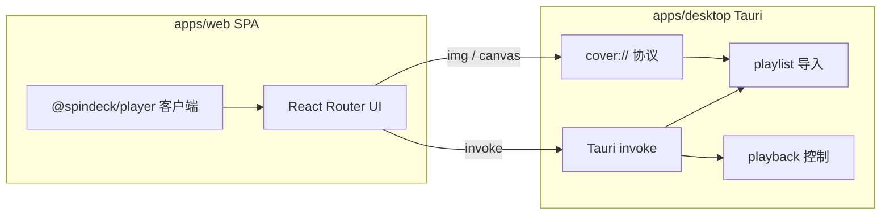

# 架构

SpinDeck 是 **SPA 前端** + **仅桌面端提供的 Rust 能力**（Tauri `invoke` + `cover://`）。界面不访问远程 SpinDeck 后端；歌单导入与本地播放控制都在桌面应用进程内完成。

## 运行模型

| 模式 | 运行内容 | 说明 |
| --- | --- | --- |
| 浏览器 / 仅 Web | Vite SPA | UI 预览。歌单导入 / 本地播放需要桌面应用 |
| 桌面端（推荐） | Tauri + 原生 WebView | SPA 由 `frontendDist` 加载；业务走 `invoke`。**用户机器不需要 Node.js** |

## Monorepo 布局

| 路径 | 职责 |
| --- | --- |
| `apps/web` | SPA（React Router，`ssr: false`），通过 `invoke` 调用桌面能力 |
| `apps/desktop` / `src-tauri` | Tauri 壳 + Rust（`app/`、`commands/`、`cover`、`playlist/`、`playback/`、`util/`） |
| `packages/player` | 前端播放策略、深链接、会话（桌面桥接 `setDesktopBridge`） |
| `packages/vinyl-ui` / `ui` / `picker` | 共享 UI 与封面取色 |
| `docs` | VitePress 文档 |

歌单导入曾位于 TypeScript 包 `@spindeck/core`；现已迁至 Rust：`apps/desktop/src-tauri/src/playlist/`。

## 桌面 IPC

| Command | 用途 |
| --- | --- |
| `import_playlist` | 导入 / 刷新歌单 |
| `play_song` | 在本地音乐应用中开始播放 |
| `pause_song` | 暂停 / 停止 |
| `resume_song` | 继续播放 |
| `playback_status` | 查询本地客户端播放状态 |
| `set_play_mode` | 设置播放模式（若平台支持） |

封面图通过自定义协议 **`cover://localhost/?url=...`**（Windows 为 `http://cover.localhost/?url=...`）代理，带 Referer 与体积上限。

## 前端说明

- 歌单元数据保存在浏览器 `localStorage`；曲目列表通过 `import_playlist` 拉取。
- 3D 书架在浏览态按滚动视口窗口挂载 mesh / 封面；进入播放并完成动画后，卸掉身后其余书的 3D 资源，只保留当前封面。细节与设计原则见 [性能与观感](./performance)。
- 数据未就绪的槽位会显示加载状态，直至曲目元数据与封面就绪。
- `@spindeck/player` 是 **浏览器客户端** — 桌面端通过 `setDesktopBridge` 接入 Tauri；关键日志可写入桌面会话日志（见 [桌面应用](./desktop)）。

## 相关指南

- [快速开始](./getting-started)
- [系统要求](./system-requirements)
- [性能与观感](./performance)
- [桌面应用](./desktop)
- [支持的平台](./platforms)
